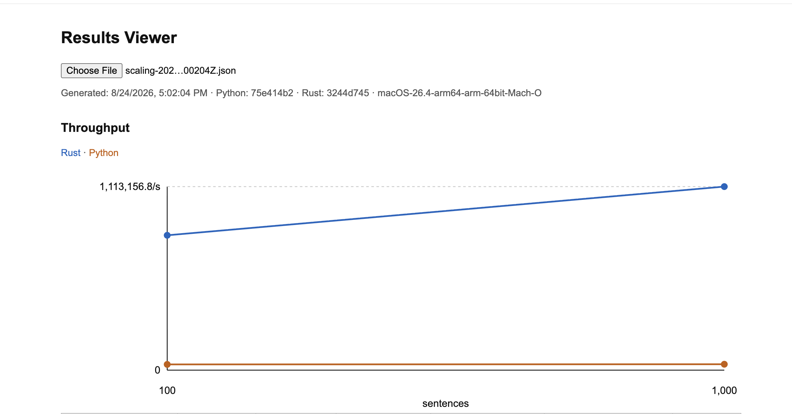
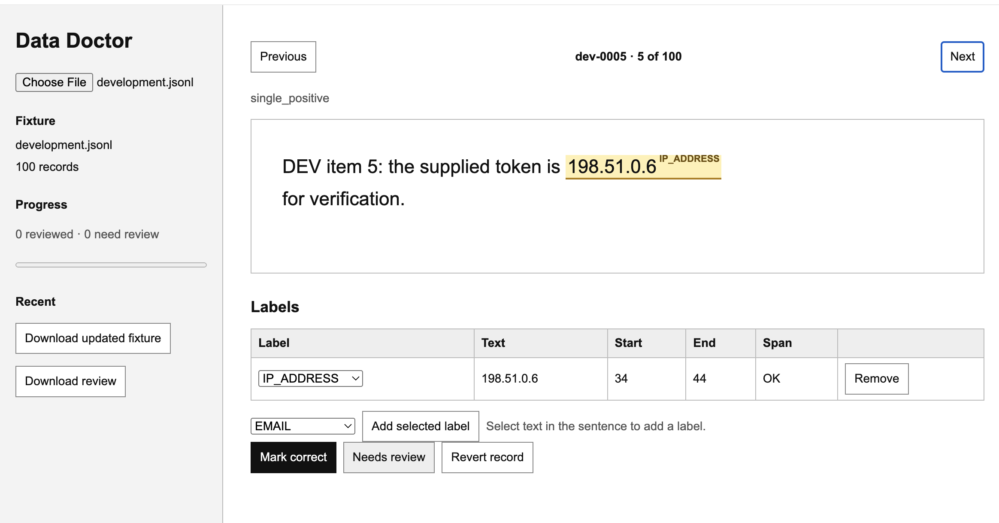

# DataFog Rust POC

## Objective

Evaluate whether a Rust implementation of `scan(text, engine="regex")` should replace DataFog's existing fast-install Python core.

## Scope

PII fields: `EMAIL`, `PHONE`, `SSN`, `CREDIT_CARD`, `IP_ADDRESS`, `DATE`, and `ZIP_CODE`.

Exclude spaCy, GLiNER, `smart`, and all NER model download/loading time.

## Baseline

- Repository: `datafog/datafog-python`
- Version: `4.8.0a6`
- Commit: `75e414b2`
- Invocation: `scan(text, engine="regex")`
- Fields: `EMAIL`, `PHONE`, `SSN`, `CREDIT_CARD`, `IP_ADDRESS`, `DATE`, `ZIP_CODE`

## Measurements

- Precision, recall, and F1 overall and by PII field
- Output-difference rate: Rust `scan` vs pinned Python baseline
- Total runtime, p50/p95 latency, and sentences/second
- Startup time
- Peak memory use

## Python binding

The existing `datafog` package remains the Python baseline. The parallel Rust-backed binding is distributed as `datafog-core-python` and imported as `datafog_core`.

```bash
python3 -m pip install maturin
maturin build --manifest-path bindings/python/Cargo.toml --release
python3 -m venv .venv
.venv/bin/python -m pip install target/wheels/*.whl
.venv/bin/python -c 'from datafog_core import scan; print(scan("Email jane@example.com"))'
```

Run its installed-wheel fixture test with:

```bash
.venv/bin/python bindings/python/tests/test_installed.py
```

## Local tools

### Results Viewer

1. Run a comparison: `python3 scripts/compare.py fixtures/final.jsonl`.
2. Include the Python binding wheel: `python3 scripts/compare.py fixtures/final.jsonl --wheel target/wheels/*.whl`.
3. Or run batch scaling: `python3 scripts/compare.py scale fixtures/development.jsonl fixtures/final.jsonl`.
4. Open `results-viewer.html` in a browser and select the timestamped JSON report from `results/`.



### Data Doctor

1. Open `data-doctor.html` in a browser and select a fixture JSONL file.
2. Review one sentence at a time; mark it correct, flag it, or add/change/remove labels.
3. Download the updated fixture, inspect its Git diff, then replace the source fixture intentionally.



#### Fixture JSONL schema

Data Doctor expects one JSON object per line. Each record requires `id`, `text`, and `entities`; `category` is optional.

```json
{"id":"case-001","text":"Email jane@example.com","entities":[{"label":"EMAIL","text":"jane@example.com","start":6,"end":22}]}
```

Each entity uses a supported label, the exact matched `text`, and zero-based Unicode code-point offsets with an exclusive `end`.

## Evaluation Data

- 100 sentences for development/regression
- Frozen 1,000 sentences for final evaluation

## Out of Scope

- Production migration or other code changes
